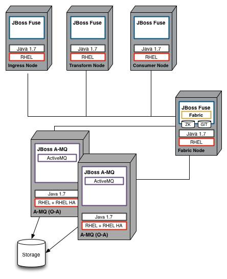

# HL7 use cases with JBoss Fuse

HL7 over MLLP is a very common transport mechanisms for systems that can speak the HL7 protocol format. JBoss Fuse is a very powerful microservices-style integration platform and has a proven track record for building flexibile, resilient, highly available integration scenarios for critical health-care providers. Additionally, replacing legacy vendors like SeaBeyond on JCAPS is the sweet spot for these types of Fuse implementations. 

## Criticality of integrations
The integrations that get deployed as part of a Fuse implementation that support health-care usecases, including HL7 integrations, are typically part of Tier 1 applications with utmost uptime and resilience requirements. These applications include, but not limited, patient admission, scheduling, lab results, and even the critical of all critical use cases: transmitting patient vitals in real time. Additionally, high levels of throughput and performance are expected.   

## Overall architecture
This POC divides a typical flow into 3 individually deployable microservices:

* `hl7-ingress` - an MLLP/HL7 collector of events
* `hl7-transform-1` - able to transform HL7 payloads from one message to another
* `hl7-consumer-1` - able to marshal HL7 payloads and send to downstream systems, EHR, etc

We also leverage ActiveMQ to provide resilient/guaranteed messaging in a Staged Event Driven Architecture pattern. 
 
With these building blocks, we can build a powerful physical deployment that has proven to withstad faults, invalid formats, network connectivity issues, failover, and perform well above expected performance (or legacy performance) metrics. 

## JBoss Fuse 
For this POC, we will build out the following architecture locally (on our laptops) but do so using process-isolation constructs to illustrate a physical deployment. Physical deployments can very based on resources you have (VMs, CPU//mem, etc). For illustration purposes, this is the architecture we will start with for this POC:

In this architecture we see these relevant components:

* 3 fuse instances, isolated at the process level
* 2 ActiveMQ brokers, in a master/slave set up
* 1 Fabric8 node which manages deployments, master/slave elections, versions, service discovery, etc.

Note, that this is the use case depicted in this POC, though is intended to help the reader understand the components and concepts at a high level. A typical deployment in a production-like setting is NOT being depicted above, however, you may be able to deduct what a more resilient environment may look like based on the pieces. Also note, with Fuse and how we've architected these services, we can choose *how* we want to deploy. In this POC we've chosen to deploy the components into individual processes but this is not a technical rule. We can deploy them all into the same process as well (though it may or may not be recommended depending on your desired architecture).

### Fuse insight!
Another alternative deployment depicted by this POC is the following:

In this depiction, we have the same above deployment of Fuse and ActiveMQ, but we also have 3 additional nodes which provide a highly-scalable, centralized logging and insight framework built on top of Elasticsearch. With Fuse, we can spin up "Fuse Insight" nodes and have all logging dumped into one spot and then use the Fuse web console to query, chart, and graph the results of calls/transactions that have propogated through the platform including debugging and SLA diagnosis. 

## Getting Started
To get started learning about how this POC is put together, [jump to the Getting Started docs](docs/getting-started.md)

