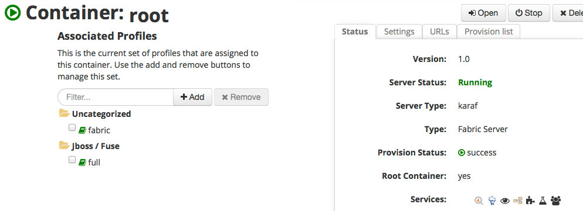
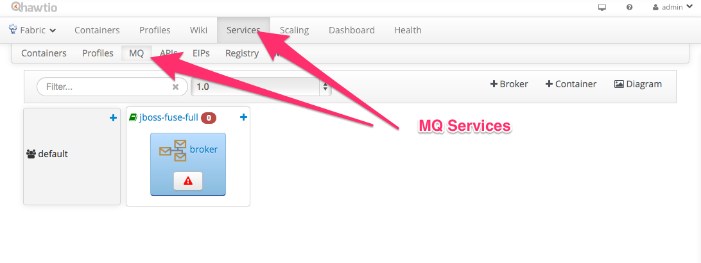
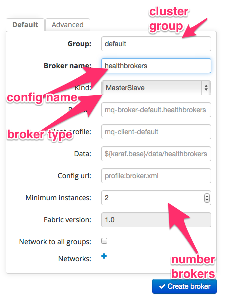
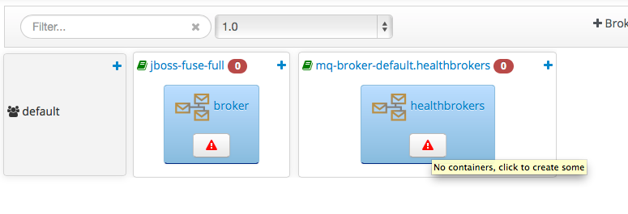
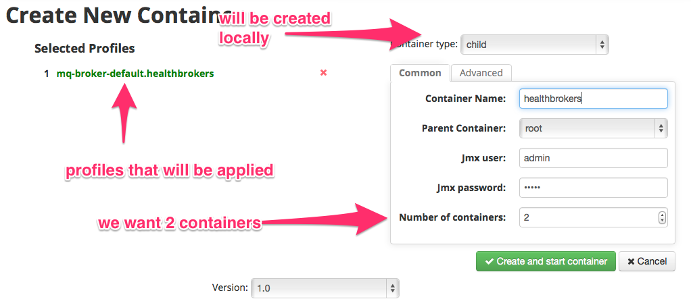
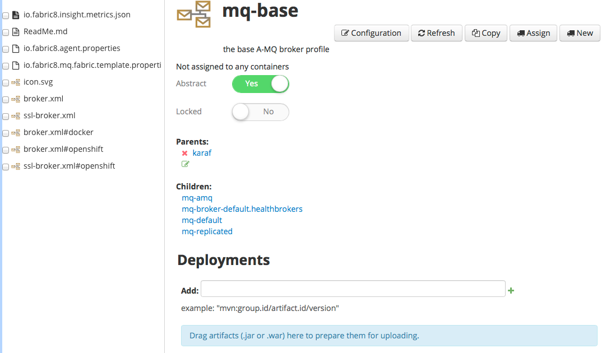

# Deploy with Fuse Fabric
JBoss Fuse has a fantastic management capability leveraging Fuse Fabric. Please take a look at the documentation on RedHat.com for more detail about Fuse Fabric, but for a quick bullet point summary, here's what fabric is/does:

Fabric is a microservices deployment/management platform for JBoss Fuse. It gives the following functionality:

* Centralized configuration management
* Service/module versioning
* Rolling deployments/rollbacks
* Audit capabilities of what changed in the environment
* Service discover
* Load balancing
* Failover
* Master/Slave elections
* more......


## Getting started with Fabric
Before we let Fuse Fabric manage our deployments, let's first create a Fabric container. If you don't have fuse running yet, navigate to the root directory and run:

    ./bin/fuse
    
At the shell that Fuse starts up, run this command:

    JBossFuse:karaf@root> fabric:create --clean --wait-for-provisioning 
    
Wait a few moments for the JVM to transform into a fabric container. Once that's happened, navigate over to `http://localhost:8181` and login with `admin/admin`. You should see a screen similar to this (click "containers" tab if you're greeted with the welcome page first):


> Note, the intention isn't to go super deep with what Fabric is or how it works. Feel free to tweet me `@christianposta` or open an issue for this repo with the detail you feel would be useful to make the flow of this POC work better


Click on the `Wiki` tab which will show you a list of `profiles` or "applications" that we can deploy:


Feel free to poke around and see what default applications/profiles exist out of the box.

### Disable fuse-full
When we first start up a fabric, the "root" node which holds all of the magic used by fabric to manage, configure, and version JVM containers and deployments will also be running a JBoss Fuse set of applications (ActiveMQ, CXF, camel, etc). But for the "root" node, we don't want to burden it with those things, so let's remove those pieces. With Fuse Fabric, removing functionality/modules/applications is as simple as removing profiles. Clikc the "containers" tab, then click the "root" container. You should see a screen like this:



Click the "full" profile and click "Remove" Wait a few moments for the root container to uninstall and re-provision itself. You may also be forced to login again. Go back and check to verify that the "full" profile was removed from the "root" container (note, due to a bug in JBoss Fuse 6.2, i had to remove that "full" profile multiple times for it to get to work :) )

Once "full" profile is removed, let's click on "services" tab and then "MQ". We are going to deploy a set of ActiveMQ brokers and use the centralized configuration management to make some changes to the default broker so it works well with our use case.

## Deploying ActiveMQ

You should see a screen similar to this:



What we want to do is create a master/slave deployemnt of ActiveMQ so that if a broker fails, the passive broker will take over from where the failed one left off. This gives us message-level guarantees, ie, that if a message gets stored to disk, it will not get lost (assuming no SPOF of disk) and will _eventually_ get delivered (note, there are some important implications of that statement). 

So click on the `Broker` button to configure a new set of ActiveMQ profiles:



Click the Create button and you should see the new broker profiles in the UI. Another thing to note is that the new broker profiles we created have a few red icons indicating that the profiles are not in a valid state. Hover over the red icons and you'll see why:



Go ahead and click those red icons which should take you to a "Create New Container" page. This will enable you to create new Fuse JVMs that have the new `healthbrokers` ActiveMQ profiles assigned. Give the containers a name and click "create and start container":
 


Now we should have 3 Fuse JVMs running. We should have the `root` container as well as the new `healthbroker` containers running. The `healthbroker` containers have ActiveMQ running in them specifically set up in a master-slave mode. 


### Turning on Virtual Topics
ActiveMQ has a wonderful feature called [Virtual Topics](http://activemq.apache.org/virtual-destinations.html). This feature allows you to do pub-sub broadcast semantics but back the subscriptions with queues. This has many benefits, but chief among them, allows to loadbalance against a single stream of messages (with durable subscriptions, you cannot do that). This allows publishers to publish to a topic and consumers consume from the stream as though they were consuming from a queue. 

One usecase I've run into with the healthcare community is the need to manually correct messages at the head of the queue. Oftentimes this behavior would be an anti-pattern as querying the queue and identifying specific messages sounds much more like a database. However, in some use cases it makes sense, and ActiveMQ allows you to do this even if using a pub-sub broadcast model with topics.

Let's configure ActiveMQ for this Virtual Topic behavior. First thing we want to do is find the `mq-base` profile and edit the `broker.xml` file that comes out of the box. This is essentially the same as the `activemq.xml` file you would expect to find in the ActiveMQ broker you know and love. Click on the `Wiki` tab, then `mq`, then `base`. You should be greeted with a screen like this:



Click on the `broker.xml` file which should take you to an screen that displays the config. Click `Edit`. In older versions of ActiveMQ the location of the next set of elements was location dependent, but nowadays you can just put it wheverever you like:


```xml
    <broker xmlns="http://activemq.apache.org/schema/core" brokerName="${broker-name}" dataDirectory="${data}" start="false" restartAllowed="false">
    ...
    <destinationInterceptors>
      <virtualDestinationInterceptor>
        <virtualDestinations>
          <virtualTopic name=">" selectorAware="false"/>
        </virtualDestinations>
      </virtualDestinationInterceptor>
    </destinationInterceptors>    
    ...
```

Now when a consumer publishes to a topic, e.g., `org.jboss.fuse.event` they can publish to `VirtualTopic.org.jboss.fuse.event` and consumers can listen to a queue named `Consumer.<name>.VirtualTopic.org.jboss.fuse.event` and receive the stream of events. For example, our consumer will listen on `Consumer.1.VirtualTopic.org.jboss.fuse.event`

As soon as you save this configuration, the changes will be propogated to the running brokers and applied in place.

## Deploying our Healthcare POC to Fuse Fabric
We can now deploy our application to fabric using profiles. If you take a look at (for example) the [hl7-ingress/pom.xml](../hl7-ingress/pom.xml), you'll see these two snippets of code;


```xml
      <plugin>
        <groupId>io.fabric8</groupId>
        <artifactId>fabric8-maven-plugin</artifactId>
      </plugin>
```

This is part of the `<build/>` section and declares the [Fabric8 maven plugin](http://fabric8.io/gitbook/mavenPlugin.html). 

> NOTE: you will need to set up the fabric8 maven plugin locally to know exactly where your fabric is running. [Please follow these directions to set it up correctly, including your maven settings.xml](http://fabric8.io/gitbook/mavenPlugin.html)

Also note the `<properties/>` section of the pom.xml:

```xml
    <fabric8.profile>healthcare-poc.hl7ingress</fabric8.profile>
    <fabric8.parentProfiles>feature-camel</fabric8.parentProfiles>
    <fabric8.features>camel-spring camel-hl7 camel-netty4</fabric8.features>
    <fabric8.bundles>mvn:${project.parent.groupId}/${project.artifactId}/${project.parent.version}</fabric8.bundles>
```

These properties define the features and parent profiles needed to implement these profiles.

From the root of the cloned project, run this command:

    mvn clean install -Pfabric fabric8:deploy
    
This will generate the profiles and upload them to your locally running fabric. Note, if your maven plugin is not configured correctly this will fail. If you have issues find me `@christianposta` on twitter or log an issue in this repo. 

You should see this if built successfully:

    b-services/1.0.0-SNAPSHOT/stub-services-1.0.0-SNAPSHOT.pom
    [INFO] 
    [INFO] <<< fabric8-maven-plugin:1.2.0.redhat-133:deploy (default-cli) @ stub-services <<<
    [INFO] 
    [INFO] --- fabric8-maven-plugin:1.2.0.redhat-133:deploy (default-cli) @ stub-services ---
    [INFO] ------------------------------------------------------------------------
    [INFO] Reactor Summary:
    [INFO] 
    [INFO] Health Care POC: Parent POM ....................... SUCCESS [6.367s]
    [INFO] Health Care POC: Features XML File ................ SUCCESS [5.117s]
    [INFO] Health Care POC: Ingress of HL7 Messages .......... SUCCESS [23.417s]
    [INFO] Health Care POC: Consumer 1 of HL7 Messages ....... SUCCESS [22.810s]
    [INFO] Health Care POC: Transformer 1 .................... SUCCESS [26.200s]
    [INFO] Health Care POC: Stub services .................... SUCCESS [0.705s]
    [INFO] ------------------------------------------------------------------------
    [INFO] BUILD SUCCESS
    [INFO] ------------------------------------------------------------------------
    [INFO] Total time: 1:25.603s
    [INFO] Finished at: Mon Oct 05 19:58:43 MST 2015
    [INFO] Final Memory: 70M/1151M
    [INFO] ------------------------------------------------------------------------
    
Now if you go to the `Wiki` tab again, you should see our new healthcare profiles:


