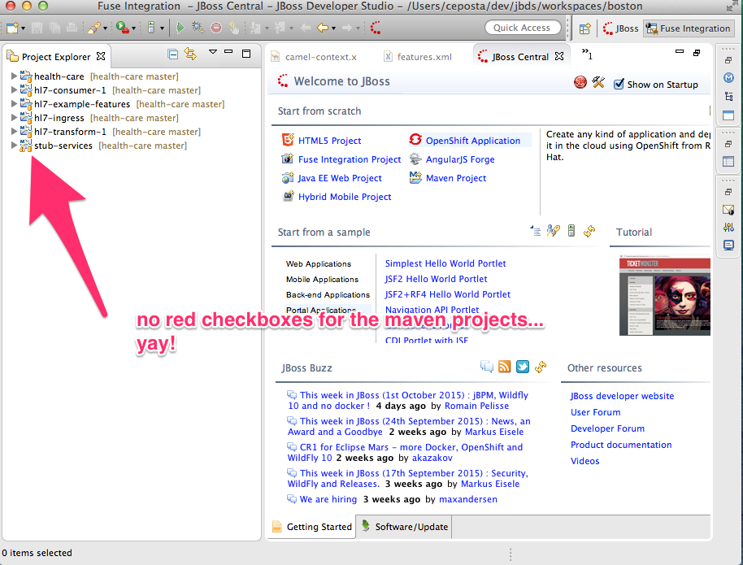

# Getting Started

To get started, clone this repository to your local machine and use your favorite tools to dig in deeper.

### Prerequisites
You'll need the following software to complete this POC:

* [JBoss Fuse 6.2](http://www.jboss.org/products/fuse/download/)
* [Maven 3.2.x](http://archive.apache.org/dist/maven/maven-3/3.2.5/)
* [Git](https://git-scm.com/downloads)
* [JBoss Developer Studio](http://www.jboss.org/products/devstudio/download/)
* [HL7 Test Panel](http://hl7api.sourceforge.net/hapi-testpanel/) -- optional 

### Command line
Navigate to directory where you want to clone this project:
    
    cd $proj_root
    git clone git@github.com:christian-posta/healthcare-poc.git
    cd healthcare-poc
    
Now run maven to build the project:

    mvn clean install 
    
Things should compile, the tests should run (successfully!) and you should end up with a terminal like this:

    [INFO] --- maven-install-plugin:2.4:install (default-install) @ stub-services ---
    [INFO] Installing /Users/ceposta/dev/poc/CHOP/workspace/hl7-example/stub-services/target/stub-services-1.0.0-SNAPSHOT.jar to /Users/ceposta/.m2/repository/org/jboss/fuse/examples/stub-services/1.0.0-SNAPSHOT/stub-services-1.0.0-SNAPSHOT.jar
    [INFO] Installing /Users/ceposta/dev/poc/CHOP/workspace/hl7-example/stub-services/pom.xml to /Users/ceposta/.m2/repository/org/jboss/fuse/examples/stub-services/1.0.0-SNAPSHOT/stub-services-1.0.0-SNAPSHOT.pom
    [INFO] ------------------------------------------------------------------------
    [INFO] Reactor Summary:
    [INFO] 
    [INFO] Health Care POC: Parent POM ....................... SUCCESS [0.120s]
    [INFO] Health Care POC: Features XML File ................ SUCCESS [0.164s]
    [INFO] Health Care POC: Ingress of HL7 Messages .......... SUCCESS [3.917s]
    [INFO] Health Care POC: Consumer 1 of HL7 Messages ....... SUCCESS [1.911s]
    [INFO] Health Care POC: Transformer 1 .................... SUCCESS [1.338s]
    [INFO] Health Care POC: Stub services .................... SUCCESS [0.616s]
    [INFO] ------------------------------------------------------------------------
    [INFO] BUILD SUCCESS
    [INFO] ------------------------------------------------------------------------
    [INFO] Total time: 8.730s
    [INFO] Finished at: Mon Oct 05 12:59:29 MST 2015
    [INFO] Final Memory: 52M/1141M
    [INFO] ------------------------------------------------------------------------


### Using JBDS
To checkout and build with JBDS, go to `File-->Import` and choose the `Existing maven project from SCM` option. In the first dialog, enter the project git URL `https://github.com/christian-posta/healthcare-poc` and click `Finish` JBDS should then proceed to clone and build the source code.




## Explore the project

We now have the project checked so let's explore it. Here are all of the projects that were imported into the IDE:

* `health-care` -- this is the top-level parent project
* `hl7-consumer-1`  -- able to marshal HL7 payloads and send to downstream systems, EHR, etc
* `hl7-example-features` -- generates a Karaf features file so we can deploy all the pieces into a Fuse JVM
* `hl7-ingress` -- an MLLP/HL7 collector of events; it exposes an HL7 endpoint and unmarshalls an HL7 payload
* `hl7-transform-1` -- able to transform HL7 payloads from one message to another
* `stub-services` -- Set of stub services that expose HL7 endpoints that can return NACK messages

If we navigate to the `hl7-ingress` project and open the `src/main/resources/META-INF/spring/camel-context.xml` file we should see the Fuse tooling display the route(s) using a visual notation. (Note, if you don't see the visual camel diagrams, make sure to install the Integration Stack as [described on the JBDS getting started page](http://www.jboss.org/products/devstudio/get-started/#!project=devstudio). 


Using the outline view off to the right, select the "main" route and you should see a diagram like this:


### Unit Tests
Camel has a [set of extensive testing modules](http://camel.apache.org/testing.html) that are very useful (and important) for building out critical integration paths. We can use the test framework to set expectations on routes, simulate exceptions and correct route behavior in failure scenarios. 

Start by navigating to `src/test/java`  in the `hl7-ingress` project and you should see a unit test named `HL7IngressRouteTest.java`. This test shows a number of things:

#### Running the unit tests with spring support using `@ContextConfiguration` and `@RunWith` annotations

```java
    @RunWith(CamelSpringJUnit4ClassRunner.class)
    @ContextConfiguration({"classpath*:/META-INF/spring/*.xml"})
    public class HL7IngressRouteTest {
```
    
    
#### [Injecting Camel endpoints and producer templates](http://camel.apache.org/pojo-producing.html) using Camel's `@Produce` and `@EndpoingInject` annotations
#### How to bootstrap a **lightweight** ActiveMQ instance, useful for testing (and how to gracefully shut down)
#### How to set expectations on the route and assert them at the end of the test

